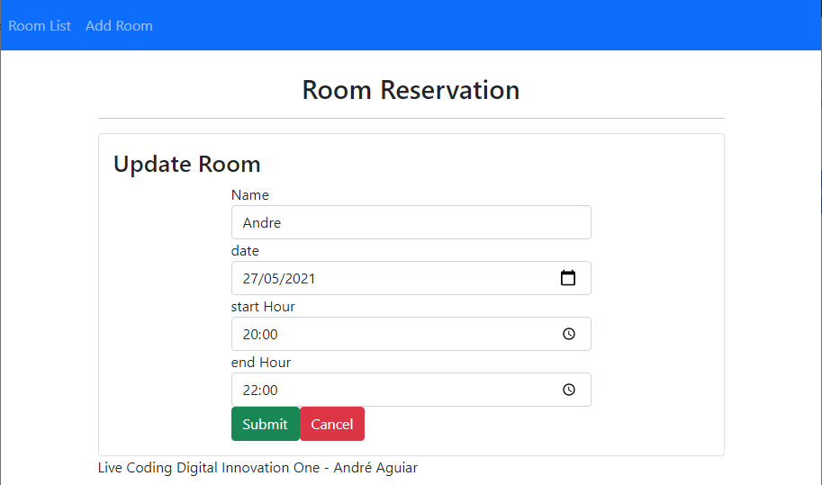

## Room Reservation

###### DESCRIÇÃO

Neste Labs foi desenvolvido uma API com Spring Boot para gerenciar nossas salas de reunião, utilizaremos o Spring Data para persistência de dados e o banco in-memory H2. E o Front End que irá consumir essa API será uma SPA escrita em Angular.

---

###### Spring Boot | Angular

###### Full-Stack | Intermediário

##### ESPECIALISTA

<h6>Kamila Santos</h6>

Backend Developer, Ame Digital

##### [Digital Innovation One](https://digitalinnovation.one/sign-up?ref=NL9EADWVZW)

---

